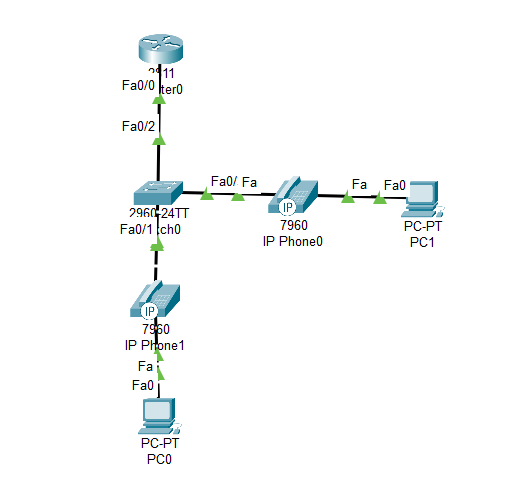

# Documentation de configuration VoIP

## Configuration du routeur

### Création du pool DHCP pour VoIP

Sur le routeur, commence par créer un pool DHCP pour le réseau VoIP :

```bash
Router(config)# ip dhcp pool voice
Router(dhcp-config)# network 192.168.0.0 255.255.255.0
Router(dhcp-config)# default-router 192.168.0.1
Router(dhcp-config)# option 150 ip 192.168.0.1
Router(dhcp-config)# exit
```

### Configuration du service téléphonique

Ensuite, configure le service téléphonique pour gérer les périphériques VoIP (téléphones) :

```bash
Router(config)# telephony-service
Router(config-telephony)# max-dn 5
Router(config-telephony)# max-ephones 5
Router(config-telephony)# ip source-address 192.168.0.1 port 2000
Router(config-telephony)# auto assign 4 to 6
Router(config-telephony)# exit
```

### Configuration des numéros d'extension (DN)

Tu peux ensuite créer les numéros d'extension pour chaque téléphone :

```bash
Router(config)# ephone-dn 1
Router(config-ephone-dn)# number 54001
Router(config-ephone-dn)# exit

Router(config)# ephone-dn 2
Router(config-ephone-dn)# number 54002
Router(config-ephone-dn)# exit
```

### Vérification de l'enregistrement des téléphones

Après avoir configuré les téléphones, vérifie leur enregistrement :

```bash
Router(config-telephony)# do wr
Router(config-telephony)# %IPPHONE-6-REGISTER: ephone-2 IP:192.168.0.2 Socket:2 DeviceType:Phone has registered.
Router(config-telephony)# %IPPHONE-6-REGISTER: ephone-1 IP:192.168.0.4 Socket:2 DeviceType:Phone has registered.
```

## Configuration du switch

### Configuration des interfaces pour les téléphones

Sur le switch, configure les interfaces pour connecter les téléphones VoIP :

```bash
Switch(config)# interface range fa0/1-5
Switch(config-if-range)# switchport mode access
Switch(config-if-range)# switchport voice vlan 1
Switch(config-if-range)# do wr
```

### Vérification de la configuration

Vérifie que la configuration du switch a été correctement appliquée :

```bash
Switch(config-if-range)# do wr
Building configuration...
[OK]
```

## Résolution des problèmes

- Si tu rencontres des conflits d'adresses IP sur le serveur DHCP, comme indiqué par `%DHCPD-4-PING_CONFLICT`, vérifie que les adresses IP assignées ne se chevauchent pas.
- Assure-toi que les téléphones sont correctement enregistrés et connectés, en vérifiant les messages comme `%IPPHONE-6-REGISTER`.
```

Cette documentation décrit les étapes de base pour configurer un réseau VoIP sur un routeur et un switch Cisco, y compris la création du pool DHCP, la configuration du service téléphonique, l'assignation des numéros d'extension, et la configuration des interfaces du switch pour la voix.